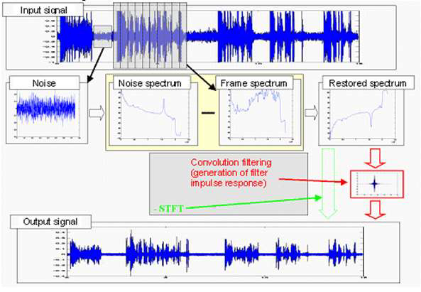
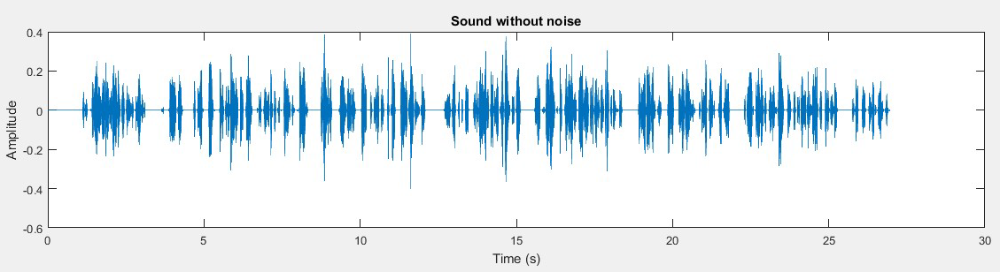

<!-- 
Text can be **bold**, _italic_, or ~~strikethrough~~.

[Link to another page](./another-page.html).

There should be whitespace between paragraphs.

There should be whitespace between paragraphs. We recommend including a README, or a file with information about your project.

# Header 1

This is a normal paragraph following a header. GitHub is a code hosting platform for version control and collaboration. It lets you and others work together on projects from anywhere.

## Header 2

> This is a blockquote following a header.
>
> When something is important enough, you do it even if the odds are not in your favor.

### Header 3

```js
// Javascript code with syntax highlighting.
var fun = function lang(l) {
  dateformat.i18n = require('./lang/' + l)
  return true;
}
```

```ruby
# Ruby code with syntax highlighting
GitHubPages::Dependencies.gems.each do |gem, version|
  s.add_dependency(gem, "= #{version}")
end
```

#### Header 4

*   This is an unordered list following a header.
*   This is an unordered list following a header.
*   This is an unordered list following a header.

##### Header 5

1.  This is an ordered list following a header.
2.  This is an ordered list following a header.
3.  This is an ordered list following a header.

###### Header 6

| head1        | head two          | three |
|:-------------|:------------------|:------|
| ok           | good swedish fish | nice  |
| out of stock | good and plenty   | nice  |
| ok           | good `oreos`      | hmm   |
| ok           | good `zoute` drop | yumm  |

### There's a horizontal rule below this.

* * *

### Here is an unordered list:

*   Item foo
*   Item bar
*   Item baz
*   Item zip

### And an ordered list:

1.  Item one
1.  Item two
1.  Item three
1.  Item four

### And a nested list:

- level 1 item
  - level 2 item
  - level 2 item
    - level 3 item
    - level 3 item
- level 1 item
  - level 2 item
  - level 2 item
  - level 2 item
- level 1 item
  - level 2 item
  - level 2 item
- level 1 item

### Small image


### Large image


### Definition lists can be used with HTML syntax.

<dl>
<dt>Name</dt>
<dd>Godzilla</dd>
<dt>Born</dt>
<dd>1952</dd>
<dt>Birthplace</dt>
<dd>Japan</dd>
<dt>Color</dt>
<dd>Green</dd>
</dl>

```
Long, single-line code blocks should not wrap. They should horizontally scroll if they are too long. This line should be long enough to demonstrate this.
```

```
The final element.
```
 -->
 
 
# Introduction

In typical day-to-day scenarios such as classroom lectures and auditorium speeches, we encounter various kinds of noises from appliances like fan and air conditioner and surrounding areas in these speech signals. These noises makes listeners difficult to understand and interpret the information in given audio signals.

# Problem Statement

Most of the noises in indoor speech signals can be typically categorised into two kinds - additive noises and unwanted frequency noises. Therefore, we design a framework to postprocess these speech signals to suppress the forementioned types of noise without too much degradation of the required information.

# Proposed Approach 

We propose a two-block framework to suppress additive noises and unwanted frequencies. 

- Band-pass filtering
  - In this block, a desired frequency band is determined using domain knowledge depending on the speech signal.
  - A band pass filter will be designed and original audio signal will be filtered using this filter in the fourier domain.
  - Finally, the signal will be constructed back into time domain.

- Spectral Subtraction
  - Assuming additive noise model, the original signal can be expressed in given format.
  - The speech signal is segmented into multiple parts with N samples in each part.
  - Each speech segment is windowed using Hamming window before N-point Discrete fourier transformed is applied (Window application reduces the effect of discontinuties at segment's endpoints.)
  - The time-averaged noise spectrum is derived from the periods where only the noise is present.
  - The noise suppressed spectrum estimate is calculated by subtracting the noise spectrum from the actual spectrum through sliding window.
  - Finally, the processed spectrum is transformed into time domain using overlap-add method.

  

  

  


# Results

| original audio                       | processed audio          
|:-------------------------------------|:-------------------------------------
|            |   
|            |    
|            |  

# Conclusion 

To conclude, these techniques are limited to speech signals with only additive noises and unwanted frequencies with certain valid assumptions. In the future, this project can be extented to real-time processing techniques for noise cancellation.
